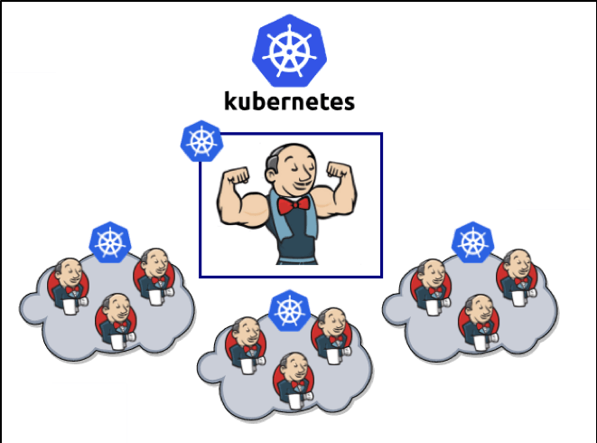

== [orange]#Déploiement "Intégration Continue" : Jenkins#

[%step]
* A chaque commit
** Reconstruction des images Docker 
** Déploiement des images vers le registry Docker
** Déploiement/Mise à jour de l'application sur Kubernetes 
* [.red]#Fortes exigences de sécurité (gestion de mots de passe, ...)#

=== Architecture Jenkins

=== Mise en Place de Jenkins

[%step]
* Déployer Jenkins dans le cluster K8s (via helm install jenkins)
* Créer des Jobs basés sur le https://github.com/jenkinsci/kubernetes-plugin[plugin kubernetes] (extension des Jenkinsfile)

=== Format des Jobs

[source, groovy]
----
podTemplate(label: 'books-api-pod', containers: [
    // construction des images
    containerTemplate(name: 'docker', image: 'docker:18.09', command: 'cat', ttyEnabled: true),

    // déploiement via helm
    containerTemplate(name: 'helm', image: 'elkouhen/k8s-helm:2.9.1c', ttyEnabled: true, command: 'cat')],
) {
    // noeud responsable du build
    node('books-api-pod') {

        container('docker') {
            // taches à exécuter dans le conteneur docker
        }
    }
}
----

=== Construction des Images

[source, groovy]
----
container('docker') {

    stage('BUILD') {

        // Injection des Credentials
        withCredentials([string(credentialsId: 'sonarqube_token', variable: 'sonarqube_tok'),
                        string(credentialsId: 'registry_url', variable: 'registry_url')]) {

        // Connexion au Registry Docker
        withDockerRegistry(credentialsId: 'nexus_user', url: "${registry_url}") {

            sh "docker build . --build-arg SONAR_TOKEN=${sonarqube_tok} --tag ${URL}/repository/docker-repository/${IMAGE}:$TAG"
            sh "docker push ${URL}/repository/docker-repository/${IMAGE}:$TAG"
        }
    }
}
----

=== Déploiement des Charts

[source, groovy]
----
container('helm') {

    stage('DEPLOY') {

        // Déploiement
        helm repo add softeamouest-opus-charts https://softeamouest-opus.github.io/charts
        helm install --name books-api softeamouest-opus-charts/books-api
    }
}
----